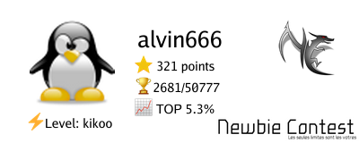

# Badges generator for challenges websites

## ✨ Inspiration

Some challenges websites like [tryhackme](https://tryhackme.org) or [hackthebox](https://hackthebox.eu) use badges you can export to have a synopsis of your progression on the website. I find it very cool so I decided to implement my own for other website I use which does'nt have this sort of badges.

## 🔨 Usage

```bash
go build .
```

```bash
./badges --website cryptohack --username thibaultserti --theme dark
```

**Supported websites:** [`cryptohack`](https://cryptohack.org) [`rootme`](https://root-me.org) [`newbiecontest`](https://newbiecontest.org)

**Supported themes:** `dark` `light`


## 🎨 Examples

### Rootme (dark)


### Newbiecontest (light)



### Cryptohack (dark)


**Caution:** for newbiecontest you should use your user id instead of your username

## 🔗 Related work

See https://github.com/HexPandaa/RootMe-Badge-Generator


## 🗒️License

MIT

## Authors

Thibault Ayanides
